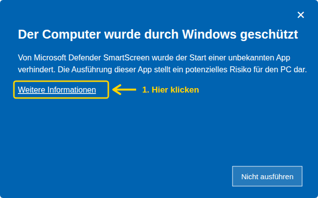
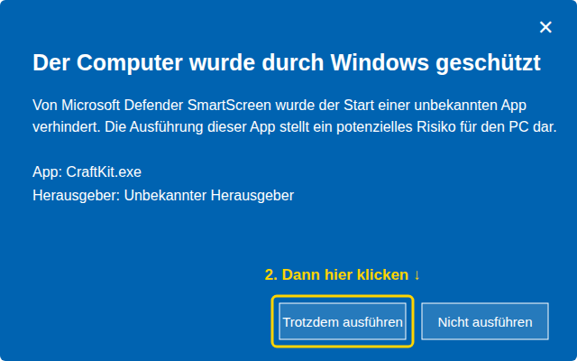

# CraftKit

**Minecraft-Versionen, Mods und Plugins installieren – mit allen Abhängigkeiten.**

CraftKit ist ein Paketmanager für Minecraft Java Edition. Er installiert Vanilla, Forge, NeoForge, Fabric oder Quilt,
lädt Mods und Plugins von Modrinth und CurseForge samt allem, was sie voraussetzen, und legt dafür Profile im
offiziellen Minecraft Launcher an. Gespielt wird wie gewohnt über den offiziellen Launcher.

## Download

Die aktuelle `CraftKit.exe` gibt es unter [Releases](../../releases/latest). Einfach herunterladen und doppelklicken –
es muss nichts installiert werden (Windows 10/11, 64 Bit).

### ⚠ Beim ersten Start: Windows-Warnung überspringen

Windows zeigt beim ersten Start wahrscheinlich eine blaue Warnung **„Der Computer wurde durch Windows geschützt“**.
Das ist bei neuen, kostenlosen Programmen normal, die (noch) kein kostenpflichtiges Signatur-Zertifikat haben. Es heißt
nicht, dass CraftKit gefährlich ist – der gesamte Quellcode ist hier öffentlich, und jede `CraftKit.exe` unter Releases
wird automatisch von GitHub aus genau diesem Code gebaut.

So startest du CraftKit trotzdem:

**1.** Klicke auf **„Weitere Informationen“**:



**2.** Klicke auf **„Trotzdem ausführen“**:



Das musst du nur einmal machen – danach startet CraftKit ohne Nachfrage. Updates installiert CraftKit selbst
(Einstellungen → Nach Updates suchen).

<details><summary>Kein „Trotzdem ausführen“-Knopf zu sehen?</summary>

- Rechtsklick auf `CraftKit.exe` → **Eigenschaften** → unten bei „Sicherheit“ **Zulassen** anhaken → **OK**, dann erneut doppelklicken.
- Auf Firmen- oder Schul-PCs kann ein Administrator das Starten unbekannter Programme ganz verbieten – dann geht es dort leider nicht.
- Wenn dein Virenscanner die Datei löscht, lade sie bitte nur von der [Releases-Seite](../../releases/latest) herunter und
  melde es als [Issue](../../issues), damit ich die Datei bei Microsoft als Fehlalarm einreichen kann.
</details>

## Funktionen

- **Instanzen** mit Vanilla, Forge, NeoForge, Fabric oder Quilt anlegen. Jede Instanz hat einen eigenen Ordner für Mods,
  Welten und Einstellungen und erscheint im Launcher als eigenes Profil.
- **Mods & Plugins** suchen und installieren. Vor jeder Installation zeigt ein Plan, welche Voraussetzungen automatisch
  mitkommen, was optional ist und was sich laut Autor nicht verträgt.
- **Entfernen** warnt, wenn andere Mods davon abhängen, und räumt auf Wunsch nicht mehr benötigte Abhängigkeiten mit weg.
- **Updates** für alle Mods einer Instanz mit einem Klick.
- **Vorhandenes erkennen**: Profile aus dem Launcher übernehmen, vorhandene Mods per Prüfsumme auf Modrinth/CurseForge
  erkennen, fehlende Abhängigkeiten auch bei selbst installierten Mods melden.
- **An einen Server anpassen**: Server-Adresse eingeben – CraftKit liest Version und (bei Forge/NeoForge) die nötigen
  Mods aus, legt eine passende Instanz an, übernimmt deine Mods in passenden Versionen und trägt den Server in die
  Mehrspieler-Liste ein.
- **Plugin-Ordner** von Servern (Paper, Purpur, Spigot, Velocity …) mit Plugins samt Abhängigkeiten befüllen.
- **Weitere Helfer**: Mods deaktivieren, einzelne Mods auf ältere Versionen setzen und festhalten, Rückgängig,
  Absturzhilfe, Weltensicherung, Ressourcenpakete & Shader, Mod-Sets, Modpacks importieren und Instanzen als .mrpack teilen.
- **14 Sprachen**: Deutsch, English, Español, Français, Italiano, Polski, Português (Brasil), Nederlands, Türkçe, Русский,
  Українська, 简体中文, 日本語, 한국어. Die Übersetzungen sind automatisch erstellt – Fehler bitte über
  „Einstellungen → Übersetzungsfehler melden“ oder direkt als [Issue](https://github.com/mariofritzer/Craftkit/issues/new?template=translation.yml) melden.

## CurseForge

Modrinth funktioniert sofort. Für CurseForge wird ein eigener API-Key benötigt, der in den CraftKit-Einstellungen
eingetragen wird. Einen Key kann man kostenlos auf [console.curseforge.com](https://console.curseforge.com/) beantragen.

## Datenschutz

CraftKit hat keine Telemetrie und sendet keine persönlichen Daten. Es verbindet sich nur mit den Diensten, die für die
jeweilige Aktion nötig sind: Mojang (Versionsliste), Fabric, Quilt, Forge und NeoForge (Loader), Modrinth und
CurseForge (Mods, Plugins und Prüfsummen zur Erkennung vorhandener Dateien), Eclipse Adoptium (Java, nur falls keines
gefunden wird) sowie Minecraft-Server, deren Adresse du selbst eingibst. Alle Einstellungen bleiben lokal in
`%APPDATA%\CraftKit`.

## Code-Signierung

CraftKit ist derzeit **nicht signiert** (deshalb die Windows-Warnung oben). Die Release-Pipeline ist für eine
kostenlose Signierung über [SignPath](https://signpath.org) vorbereitet; sie wird aktiviert, sobald das Projekt
dafür bekannt genug ist.

- Autor und Freigabe: [mariofritzer](https://github.com/mariofritzer)

## Selbst bauen

Benötigt [Go](https://go.dev) 1.22 oder neuer:

```
go test ./...
GOOS=windows GOARCH=amd64 go build -ldflags "-H windowsgui -s -w" -o CraftKit.exe .
```

Mit `-X 'main.defaultCurseForgeKey=…'` lässt sich ein CurseForge-Key voreinstellen (nur für private Builds).
`go build -tags mock` baut eine Testversion, die alle Online-Dienste simuliert.

Neue Versionen veröffentlichen: auf GitHub unter *Releases → Draft a new release* einen Tag wie `v1.0.1` anlegen und veröffentlichen – GitHub Actions baut die exe und hängt sie ans Release.

## Übersetzungen

Deutsch ist die Ausgangssprache: Texte stehen im Code als `tr("…")` (Oberfläche) bzw. `L("…")`, `errf("…")`,
`sprintf("…")` (Go). Die Übersetzungen liegen in `web/i18n/<sprache>.json` (deutscher Text → Übersetzung).
`python3 tools/i18n_check.py` zeigt fehlende oder kaputte Einträge.

## Lizenz

[MIT](LICENSE). Minecraft ist eine Marke von Mojang Studios; CraftKit ist kein offizielles Produkt und nicht mit Mojang
oder Microsoft verbunden.
